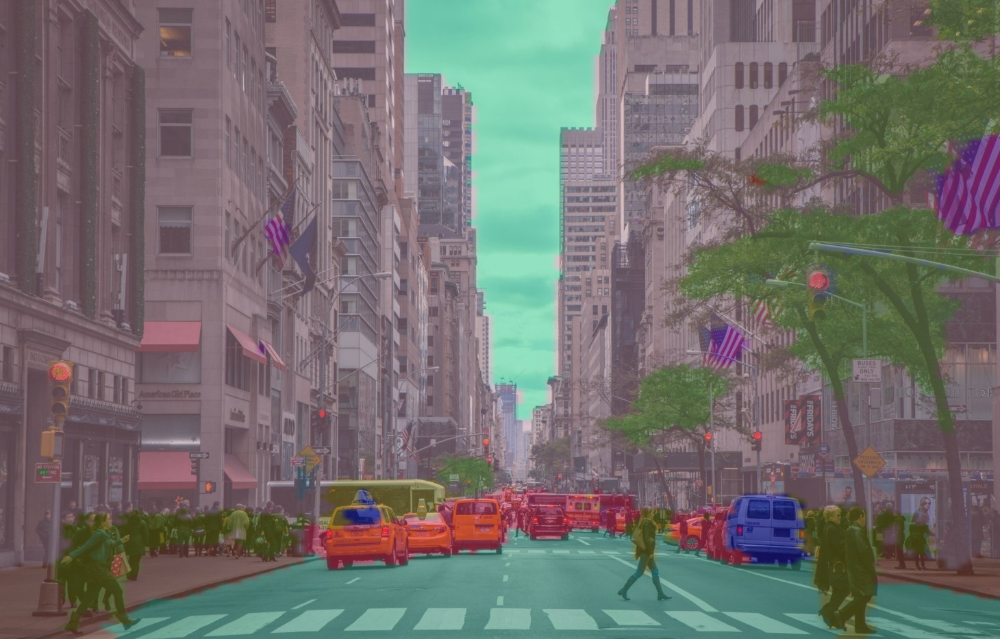

# Image Segmentation App

## Overview
This is a **Streamlit-based web application** that allows users to upload an image and perform **semantic segmentation** using a pre-trained deep learning model from Hugging Face. The backend uses a **SegFormer model** from NVIDIA, which is fine-tuned on the ADE20K dataset.

## Features
✅ Upload an image (JPG, PNG, JPEG)  
✅ Apply **semantic segmentation** using a pre-trained model  
✅ View the segmented image with an overlay  
✅ Run locally with Streamlit  

## Project Structure
```
IMAGE-SEGMENTATION-STREAMLIT/
├── backend/
│   ├── __pycache__/
│   ├── __init__.py
│   ├── segmentation.py      # ML model logic for segmentation
│   ├── utils.py             # Utility functions
├── frontend/
│   ├── __init__.py
│   ├── app.py               # Streamlit frontend
├── models/
│   ├── nvidia/segformer-b1-finetuned-ade-512-512/
│   │   ├── feature_extractor
│   │   ├── model
├── venv/                    # Virtual environment (ignored by git)
├── .gitignore               # Ignore unnecessary files (e.g., venv/)
├── config.json              # Configuration file for model settings
├── requirements.txt         # List of dependencies
├── test.ipynb               # Jupyter notebook for testing
└── README.md                # Project documentation
```

## Installation
### 1. Clone the Repository
```bash
git clone https://github.com/your-username/image-segmentation-app.git
cd image-segmentation-app
```

### 2. Create a Virtual Environment
```bash
python -m venv venv  # Create virtual environment
source venv/bin/activate  # Activate on Mac/Linux
venv\Scripts\activate  # Activate on Windows
```

### 3. Install Dependencies
```bash
pip install -r requirements.txt
```

## Running the Application
### **1. Start the Streamlit App**
```bash
cd frontend
streamlit run app.py
```
This will open the app in your web browser.

## Configuration
Model details are stored in **`config.json`**, which allows easy modification of the segmentation model:
```json
{
    "model": {
        "model_path":"../models/nvidia/segformer-b1-finetuned-ade-512-512/model/"
    },
    "feature_extractor": {
        "feature_extractor_path":"../models/nvidia/segformer-b1-finetuned-ade-512-512/feature_extractor/"
    }
  }
```

## How It Works
1. **Upload an Image** → The app reads the image and preprocesses it.
2. **Perform Segmentation** → A **SegFormer** model predicts segmentation masks.
3. **Overlay Results** → The segmented output is displayed with color overlays.

## Example Output
### Original Image


### Segmented Image

Original Image → Segmented Image Overlay:


## Deployment
You can deploy this app using **Streamlit Cloud**, **AWS**, or **GCP**:
```bash
streamlit run app.py
```

## License
This project is **MIT Licensed**. Feel free to use and modify!

## Contributors
- **Your Name** ([@your-username](https://github.com/your-username))

## Acknowledgments
🚀 Powered by [Streamlit](https://streamlit.io/) & [Hugging Face Transformers](https://huggingface.co/).

